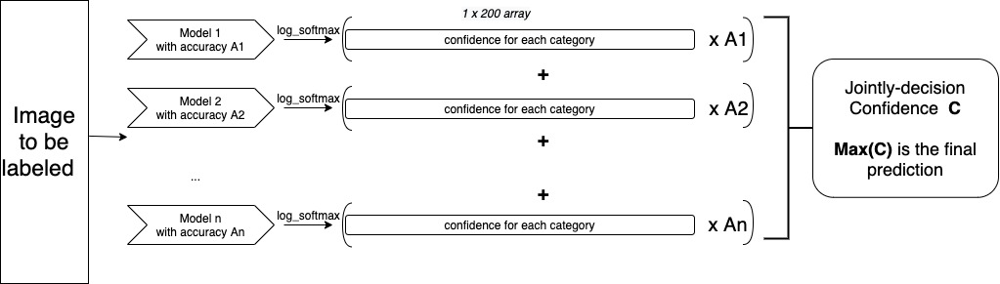

# ACSE 4.4 - Machine Learning Miniproject
# The Identification Game

All information available here: https://www.kaggle.com/c/acse-miniproject/overview

This project aims to classify 64*64 pictures with 3 RGB channels to 200 categories. 100000 training pictures with labels were provided when 10000 unlabeled pictures were provided as test data. Transfer learning on some mature neural network models were tried and got validation accuracy from 0.35-0.824. Finally, it was decided to combine the top 4 models together and get an outstanding top 3 accuracy of 0.841 at leaderboard.   
Working Flow for Combined Model:   
  
model used (DenseNet Code with ML and the ensemble code were documented for demonstration):  
[Google_Inception_v3](Single_Model/Inception_raw_code.ipynb)    
[ResNet50](Single_Model/ResNet_Training.py)  
[RestNet101](Single_Model/wide-resnet101_raw_code.ipynb)  
[DenseNet](Single_Model/Demo_code_with_densenet.ipynb)   
[DenseNet_ML](Single_Model/Demo_with_densenet_ml.ipynb)  
ensemble code:     
[code](Joint_decision/joint_decision.ipynb)  
Model tried:    

|Model      |Pre-trained|Val Acc    |	Trained dimensions|	Torch model Used |  
| :------    | :------:  |  :------: | :-----:         |  :-----:      | 
|Combine Model| yes| 0.877  | 299 224 144| Inception_v3+ResNet50+ResNet101|
|Combine Model| yes| 0.864  | 299 224 144 128| Inception_v3+ResNet50+ResNet101+ DenseNet|
|Inceptionv3  |	yes     |	0.753   | 299            |	inception_v3   |  
|ResNet50    |yes      |	0.8284  |  224           |	wide_resnet_50_2|  
|ResNet101   | yes     |  0.787    |	144          |	wide_resnet101_2|  
|DenseNet    |yes      |0.788     |	128            |  densenet161    |  
|vgg       | no      | 0.35     |	64           |	not used      |  
|GoogleNet   | yes     |  0.557    |64             |	googlenet    |  
|Hardnet68   |yes      |	0.6031  |	64           |	hardnet68     |  
|Hardnet68   | yes     |    0.625  |64             |	hardnet85    |  
| ResNext    |yes      |    0.6499 |  64            |resnext101_32x8d  |  

google drive links for all the PTH files:   
https://drive.google.com/drive/folders/1IILwNPktyeMQ-ujK6UkMxVRs3xVfVz1c?usp=sharing  
Presentation Video link:   
https://web.microsoftstream.com/video/f28c4080-15f3-4c89-b9fc-99609a78f400  
Requirements:  

-torch  
-torchvision  
-sklearn  
-matplotlib  
-livelossplot  
-numpy  
-pycm  
-pandas  
Suggested requirement: Cuda for GPU runs  
