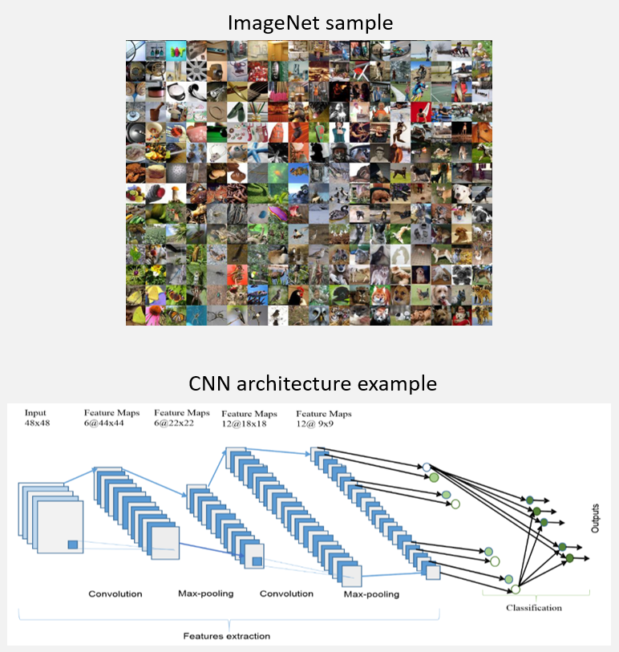

# Machine Learning Competition @ Imperial College

The aim of the competition was to develop a classifier on an image dataset consisting of Natural Images (from ImageNet), with 3 RGB channels and 200 categories. 100k images with labels were provided when 10000 unlabeled pictures were provided as test data. Transfer learning on some mature neural network models was applied and the final validation accuracy of the ensemble model was 82.4%. Finally, it was decided to combine the top 4 models together and get a top 3 accuracy of 84.1% on the leaderboard.

Further information available here: https://www.kaggle.com/c/acse-miniproject/overview

## Models and methodology

### Model table of results:

|Models      |Pre-trained|Val Acc    |	Trained dimensions|	Torch model Used |  
| :------    | :------:  |  :------: | :-----:         |  :-----:      | 
|Combined Model 1| yes| 0.877  | 299 224 144| Inception_v3+ResNet50+ResNet101|
|Combined Model 2| yes| 0.864  | 299 224 144 128| Inception_v3+ResNet50+ResNet101+ DenseNet|
|Inceptionv3  |	yes     |	0.753   | 299            |	inception_v3   |  
|ResNet50    |yes      |	0.8284  |  224           |	wide_resnet_50_2|  
|ResNet101   | yes     |  0.787    |	144          |	wide_resnet101_2|  
|DenseNet    |yes      |0.788     |	128            |  densenet161    |  
|vgg       | no      | 0.35     |	64           |	not used      |  
|GoogleNet   | yes     |  0.557    |64             |	googlenet    |  
|Hardnet68   |yes      |	0.6031  |	64           |	hardnet68     |  
|Hardnet68   | yes     |    0.625  |64             |	hardnet85    |  
| ResNext    |yes      |    0.6499 |  64            |resnext101_32x8d  |  

Working Flow for Combined Model:   
  

### Models list:

[Google_Inception_v3](Single_Model/Inception_raw_code.ipynb)    
[ResNet50](Single_Model/ResNet_Training.py)  
[RestNet101](Single_Model/wide-resnet101_raw_code.ipynb)  
[DenseNet](Single_Model/Demo_code_with_densenet.ipynb)   
[DenseNet_ML](Single_Model/Demo_with_densenet_ml.ipynb)  
ensemble code:
[code](Joint_decision/joint_decision.ipynb)

### Files:

google drive links for all the PTH files:   
https://drive.google.com/drive/folders/1IILwNPktyeMQ-ujK6UkMxVRs3xVfVz1c?usp=sharing  
Presentation Video link:   
https://web.microsoftstream.com/video/f28c4080-15f3-4c89-b9fc-99609a78f400

## Requirements:  

-torch  
-torchvision  
-sklearn  
-matplotlib  
-livelossplot  
-numpy  
-pycm  
-pandas  
Suggested requirement: Cuda for GPU runs  
